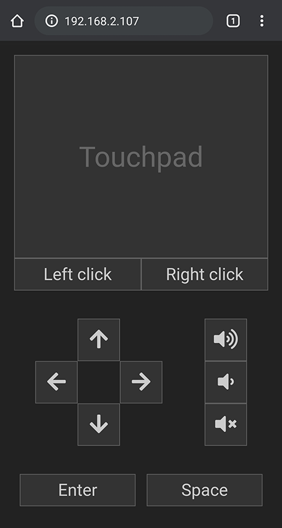

# ReCon

A **Re**mote**Con**trol for computers

## Usage

Run the app via `node index.js` and navigate to your computer's IP address with
your smartphone browser.

On Windows, you can get your IP address by using the `ipconfig` command.

## :warning: Notes

- At the moment, the CSS is only optimized for mobile devices in portrait mode.
If you want to test it on your PC, you need to emulate a mobile device in your
browser's development tools.
- This app makes heavy use of modern JavaScript and CSS features, so make sure
the browser you are using on your phone is not *too* old. It should
work fine with most up-to-date browsers.
